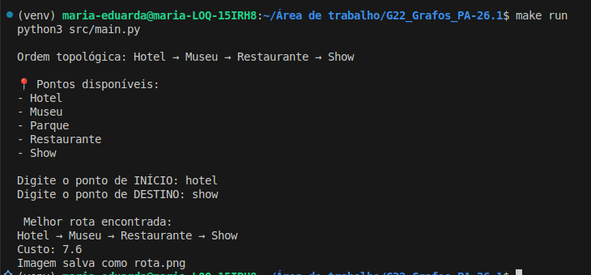
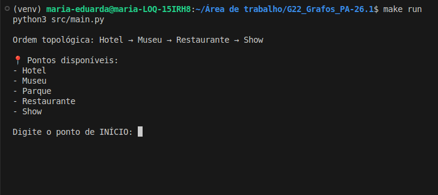
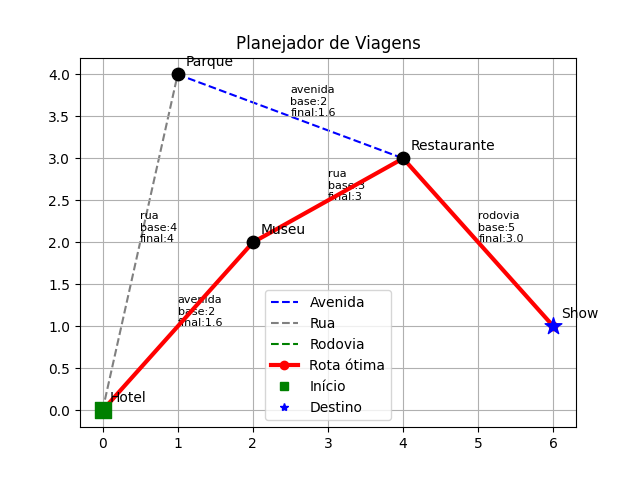

# Planejador de Viagem

Número da Lista: 1<br>
Conteúdo da Disciplina: Grafos<br>

## Alunos
| Matrícula | Aluno                            |
| --------- | -------------------------------- |
| 21/1061903 | Isaque Santos                    |
| 20/0023985 | Maria Eduarda dos Santos Marques |


## Sobre 
Este projeto tem como objetivo simular um sistema de planejamento de rotas em um contexto de viagem, considerando:

- Restrições de ordem entre locais (dependências)
- Diferentes tipos de vias
- Custos de deslocamento
- Escolha de rota ótima entre dois pontos

A solução foi construída utilizando dois algoritmos fundamentais da teoria dos grafos:

- Ordenação Topológica → validação de sequência
- Algoritmo A* → cálculo do melhor caminho

O sistema funciona modelando o problema como um grafo, onde:

- Os nós representam locais (Hotel, Museu, Parque, Restaurante e Show)
- As arestas representam os caminhos entre esses locais
- Cada aresta possui um custo ajustado pelo tipo de via (rua, avenida ou rodovia)

A ordenação topológica é utilizada para garantir que a ordem de visita respeite as dependências definidas, enquanto o algoritmo A* é responsável por calcular a melhor rota entre dois pontos escolhidos pelo usuário.

## Screenshots

# Tela inicial


# Tela de execução 


# Tela de resultado


## Instalação 
Linguagem: Python<br>

## Apresentação do projeto 

[https://youtu.be/IPuYcgSVxe0](https://youtu.be/IPuYcgSVxe0)


### Pré-requisitos

- Python 3 instalado
- Ambiente virtual (recomendado)

### Passos para execução
```bash
# Criar ambiente virtual
python3 -m venv venv

# Ativar ambiente virtual (Linux)
source venv/bin/activate

# Instalar dependências
pip install matplotlib
```


## Uso 

Para executar o projeto:

```bash
python src/main.py
```

### Passo a passo

1. O programa exibirá os pontos disponíveis:
   - Hotel
   - Museu
   - Parque
   - Restaurante
   - Show

2. O usuário deve digitar:
   - Ponto de início
   - Ponto de destino

3. O sistema irá:
   - Validar se os pontos existem
   - Verificar se respeitam a ordem definida
   - Calcular a melhor rota utilizando A*

4. O resultado será exibido com:
   - Caminho encontrado
   - Custo total
   - Geração da imagem `rota.png`

## Outros 

### Organização do Projeto

O projeto foi dividido em módulos para melhor organização:

- `grafo.py` → estrutura do grafo  
- `a_estrela.py` → cálculo da rota  
- `topologica.py` → validação de dependências  
- `visualizacao.py` → geração da imagem  
- `main.py` → controle geral  

---

### Visualização

A visualização da rota é feita utilizando **matplotlib**, destacando:

- ponto inicial  
- ponto final  
- caminho percorrido  
- pesos das arestas  
